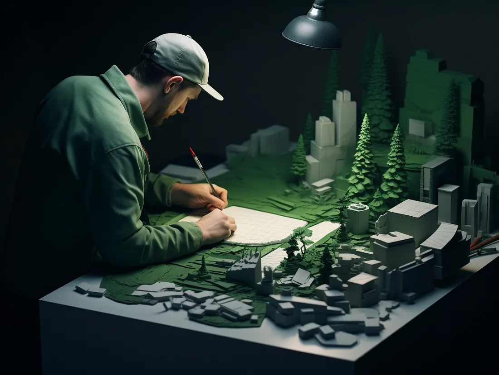
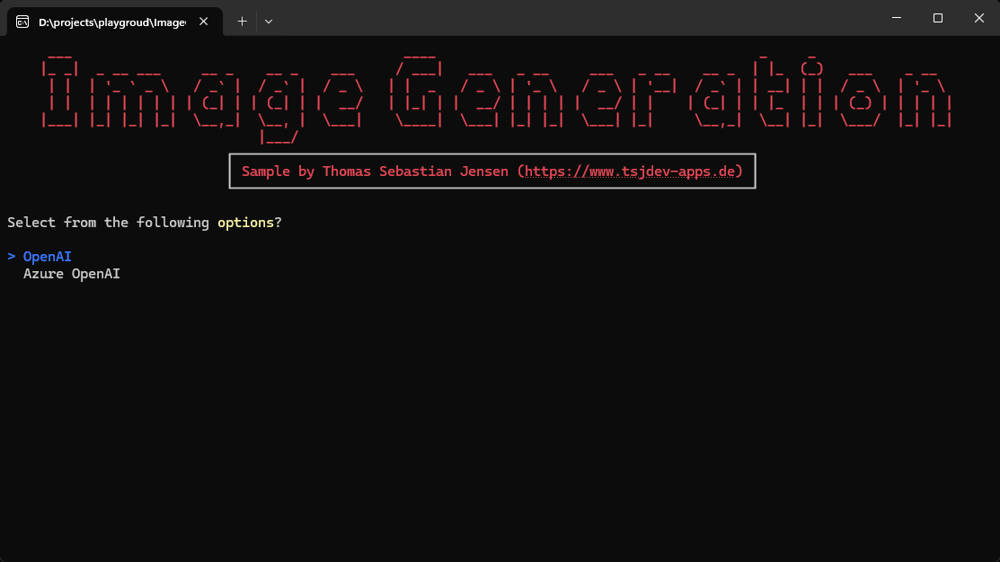
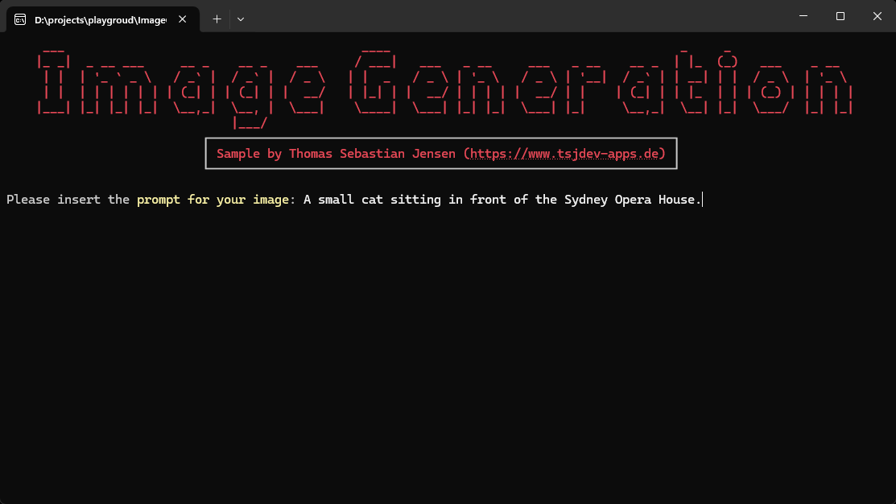
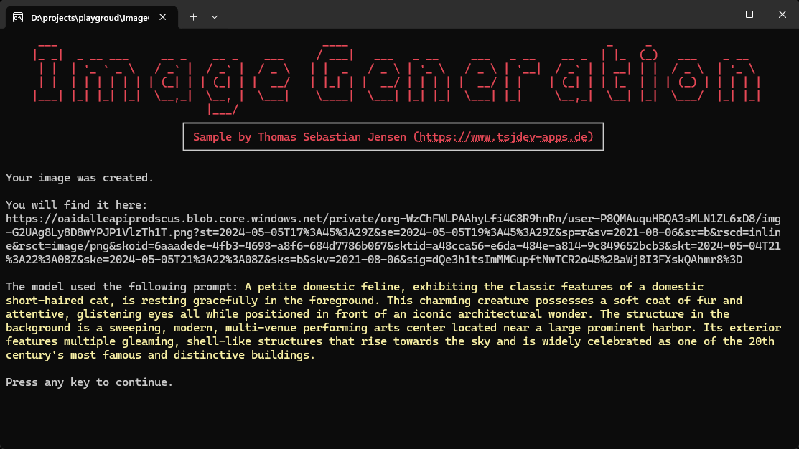

# Create stunning images with DALL·E 3 with (Azure) OpenAI

This repository contains a simple console application written in .NET 8 to demonstrate how to create stunning images with [OpenAI](https://openai.com) and/or [Azure OpenAI](https://azure.microsoft.com/en-us/products/ai-services/openai-service) using the [Azure.AI.OpenAI](https://www.nuget.org/packages/Azure.AI.OpenAI/) NuGet package.

## Usage

You need to create an OpenAI account on this [website](https://platform.openai.com/docs/overview). You have to pay to use the API so make sure that you add your payment information. After that, you can create an API Key [here](https://platform.openai.com/api-keys) for further use. If you have access to an Azure OpenAI instance you can also use this instance for the demo application.

Just run the app and follow the steps displayed on the screen.

## Screenshots

HEre you can se the console application in action.

First you need to select the host.

You need to enter the needed properties, like endpoints or API keys. Finally you can insert your prompt to describe the desired image.

You will be presented with a link to the generated image and also an extended version of the prompt.

The following image is the generated image for the prompt `A small cat sitting in front of the Sydney Opera House.`

## Blog Posts / YouTube Video

If you are more interested into details, please see the following posts on [medium.com](https://www.medium.com) or in my [personal blog](https://www.tsjdev-apps.de):

- [Use OpenAI’s DALL-E 3 to generate stunning images](https://medium.com/medialesson/use-openais-dall-e-3-to-generate-stunning-images-ef1a301bc046)
- [Einrichtung von OpenAI](https://www.tsjdev-apps.de/einrichtung-von-openai/)
- [Einrichtung von Azure OpenAI](https://www.tsjdev-apps.de/einrichtung-von-azure-openai/)

You can also watch the following video on my [YouTube channel](https://www.youtube.com/@tsjdevapps):
- [Bild-Generierung mit (Azure) OpenAI und DALL-E 3](https://www.youtube.com/watch?v=G6cyQuQMo6Q)

## Buy Me A Coffee

I appreciate any form of support to keep my _Open Source_ activities going.

Whatever you decide, be it reading and sharing my blog posts, using my NuGet packages or buying me a coffee/book, thank you ❤️.

